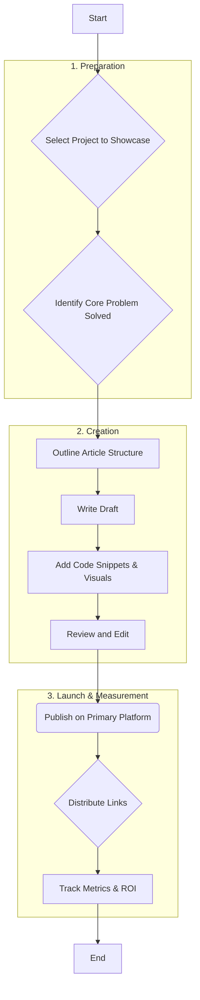

# Strategy: Attracting Inbound Opportunities

This document outlines the process for writing and distributing high-quality content to attract inbound job and gig opportunities, positioning you as a visible expert.

---

## 1. The Content Creation Flowchart

This diagram details the steps from idea to distribution and measurement.

---

## 2. Actionable Todo List

Follow these steps to create and promote your first article.

- [ ] **Preparation**
    - [ ] Choose a project to showcase (e.g., `PHP-ABAC-AUTH` or `DOCKER-CONFIG_WEB-DEV`).
    - [ ] Define the single, clear problem your project solves for a potential client.
    - [ ] Create a simple outline: Introduction, The Problem, The Solution, Key Code Examples, Conclusion.
- [ ] **Content Creation**
    - [ ] Write the first draft of the article.
    - [ ] Select and format clean, readable code snippets to include.
    - [ ] Create or add visuals (screenshots, simple diagrams).
    - [ ] Proofread and edit the article for clarity, grammar, and flow.
- [ ] **Launch & Distribution**
    - [ ] Publish the article on your chosen primary platform.
    - [ ] Post a link and a brief, engaging summary on LinkedIn.
    - [ ] Share the link on relevant Reddit communities (e.g., `r/php`, `r/devops`).
    - [ ] Share the link on Hacker News.
    - [ ] Add the article link to your resume and your LinkedIn "Featured" section.
- [ ] **Tracking**
    - [ ] Set up a simple spreadsheet to track your articles.
    - [ ] After one week, log the initial metrics (views, likes, comments).
    - [ ] Log any inbound messages, emails, or profile views that reference the article.

---

## 3. Where to Post Your Content

#### Primary Platforms (Choose one per article)
*   **Medium:** Large built-in audience, good for general discoverability.
*   **dev.to:** A very welcoming and active community of developers.
*   **Hashnode:** Another popular, developer-focused blogging platform.
*   **Personal Blog/Website:** Gives you full control and is best for long-term brand building (e.g., using GitHub Pages).

#### Distribution Channels (Share on all relevant channels)
*   **LinkedIn:** Essential for professional visibility and reaching recruiters.
*   **Reddit:** Target specific, relevant subreddits like `r/php`, `r/laravel`, `r/devops`, `r/webdev`.
*   **Hacker News:** Can drive significant traffic if the content is high-quality.
*   **Twitter / X:** Good for sharing with relevant hashtags (`#php`, `#docker`, `#laravel`).

---

## 4. Tracking Progress and ROI

Your "Return on Investment" is the value of the opportunities generated versus the time you invested.

#### What to Track
*   **Views/Reads:** A basic measure of reach.
*   **Engagement:** Likes, comments, and shares. Shows if the content is resonating.
*   **Inbound Inquiries:** The most important metric. Any email, LinkedIn message, or contact that mentions your article.
*   **Profile Views:** A spike in your LinkedIn profile views after posting is a strong positive signal.

#### How to Track
*   **Simple Spreadsheet:** Create a sheet with columns for: `Article Title`, `Publish Date`, `Platform`, `Views (Week 1)`, `Engagement (Week 1)`, `Inbound Inquiries (Count)`, and `Notes`.
*   **Link Shorteners (Optional):** Use a service like bit.ly to create unique links for each channel to see which one drives the most traffic.

#### Calculating ROI
*   **Investment:** Log the approximate hours you spend creating and distributing an article.
*   **Return:** The number of meaningful conversations, interview requests, or gig offers you receive.
*   **Analysis:** After publishing 2-3 articles, review your tracker. If you spent 8 hours and got two high-quality inquiries, your ROI is excellent. If you got zero, you can use the data to adjust your topics or distribution strategy. The goal is to find what works and do more of it.
