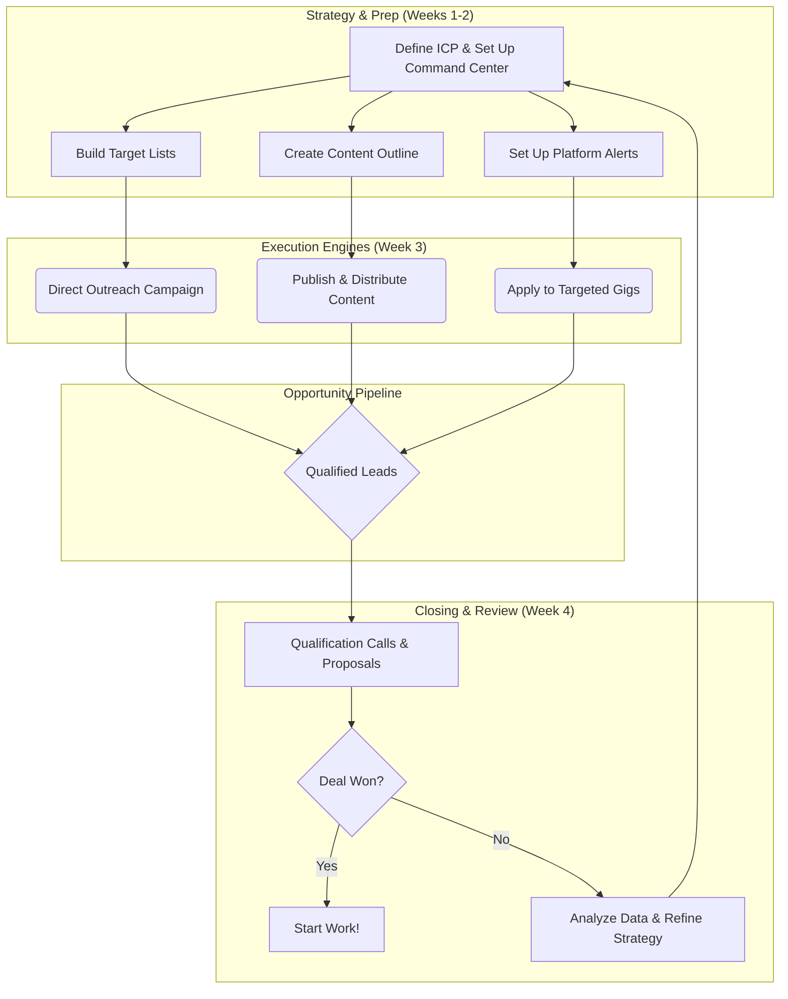

# The Master Job Search Plan

## 1. Overview & Philosophy

This document outlines a proactive, multi-channel strategy for finding a remote, part-time role. The goal is to **generate high-quality opportunities** rather than passively applying to job boards.

The core philosophy is to operate as a "business-of-one," where you are not just a job seeker but a sales and marketing team for your own expertise. Your portfolio is your product, and you will use systematic processes to find clients.

**Core Strategies (The "Engines"):**

*   **Direct Outreach (Outbound):** Proactively contact ideal clients who may not be advertising a role.
    *   *Detailed Playbook: `predictable_revenue_summary.md`*
*   **Content Creation (Inbound):** Attract clients by showcasing your expertise through articles and tutorials.
    *   *Detailed Playbook: `inbound_content_strategy.md`*
*   **Targeted Gig Applications:** Systematically apply only to high-value gigs on specialized platforms.
    *   *Detailed Playbook: `gig_work.md`*

**The Mindset:**

*   You are a proactive consultant solving problems, not a passive applicant asking for a job.
    *   *Detailed Playbook: `job_search_as_sales.md`*

---

## 2. Your Job Search Command Center: Tools & Systems

This section details the one-time setup of your operational system. This is your command center for executing the plan.

### Your Professional Hub: The GitHub.io Site

Your `[username].github.io` site is your professional home base. It's the single link you want everyone to see.

*   **Craft a Powerful Headline:** Your homepage title should be your value proposition (e.g., "**Backend & DevOps Specialist | Building Scalable PHP Applications & Streamlining Workflows with Docker.**").
*   **Create a "My Best Work" Section:** Curate **3-4 of your best projects**. For each, provide a title, a 1-2 sentence description of the business problem it solves, and links to the `[Case Study]`, `[GitHub Repo]`, and `[Live Demo]`.
*   **Build Detailed "Case Study" Pages:** For each major project, create a dedicated page that includes the Problem, your Solution, the Tech Stack, and links. This is where you embed your extensive documentation.
*   **Add "Services" and "Writing" Sections:** Clearly list the services you offer and link to the articles you write.
*   **Make Contact Easy:** Include a clear "Contact Me" button linked to your professional email.

### Your Central Database: Using Notion

Use a free tool like **Notion** to act as your personal CRM and keep everything in one place.

*   **Create a "Job Search HQ" Page:** This will be your main dashboard.
*   **Build a Master "Opportunities" Database:** This is the heart of your system. Use a "Board" view where columns represent your `Status` pipeline:
    *   `Research / To Do`
    *   `Outreach Sent`
    *   `In Conversation`
    *   `Proposal Sent`
    *   `Won`
    *   `Lost / On Hold`
*   **Configure Properties:** For each company/gig card, add fields for `Contact Person`, `Next Follow-up Date`, `Source`, and `Link`.
*   **Create a Calendar View:** Make a new view of your database and set it to use the `Next Follow-up Date`. This creates an automatic follow-up calendar.
*   **Create a Dedicated Email Address:** Use a professional address like `your.name.dev@gmail.com` for all job search communications to keep everything centralized.

### Your Operating System: ADHD-Friendly Routines

*   **Time Block Your Calendar:** Schedule recurring, non-negotiable blocks of time for specific tasks. This creates a predictable routine and removes "what should I do now?" anxiety.
    *   **Mon/Wed (9-10 AM):** Prospecting & Outreach.
    *   **Tue/Thu (9-10 AM):** Content & Skill Development.
    *   **Friday (9-10 AM):** Review & Planning.
*   **Use Checklists:** Use Notion's template feature to create a standard checklist for every new opportunity you add (e.g., `[ ] Found contact`, `[ ] Sent email #1`, `[ ] Set follow-up date`).
*   **Automate Reminders:** When you complete an action (like sending an email), immediately drag the card in Notion to the next `Status` column and set the `Next Follow-up Date`. Your calendar view will do the rest.

---

## 3. The Master Process Flowchart

This diagram visualizes how your different strategies work together as a system.

---

## 4. The 4-Week Rolling Action Plan

This is a repeatable, monthly cycle. Refer to your "Command Center" setup for how to execute these tasks.

### Week 1: Foundation & Strategy

**Goal:** Prepare all assets and define your target market.

- [ ] **Setup:** Build your "Job Search Command Center" in Notion and on your GitHub.io site as described above.
- [ ] **Finalize ICP:** Document your Ideal Client Profile in a Notion page.
- [ ] **Build Target List:** Populate your Notion database with your first 20 target companies.
- [ ] **Tooling:** Sign up for the free tiers of Hunter.io and Apollo.io.

### Week 2: Asset & Campaign Preparation

**Goal:** Prepare all materials for your outreach and content campaigns.

- [ ] **Write Templates:** Create your email and proposal templates in your Notion "Templates" page.
- [ ] **Set Up Automation:** Create and save your filtered searches and email alerts on gig platforms.
- [ ] **Outline Article:** Create a detailed outline for your first "Inbound Method" article in Notion.

### Week 3: Execution & Launch

**Goal:** Go live with your first wave of outreach and content.

- [ ] **Launch Direct Outreach:** Using your templates and Notion board, send your personalized email campaign. Update the status of each card as you go.
- [ ] **Publish & Distribute Article:** Write, publish, and distribute your article across your chosen channels.
- [ ] **Apply to Targeted Gigs:** Using your alerts, apply to 3-5 high-quality, well-matched gigs, tracking them in Notion.

### Week 4: Review, Refine, & Follow-up

**Goal:** Analyze data, manage conversations, and prepare for the next cycle.

- [ ] **Follow Up:** Use your Notion calendar view to follow up with every prospect who hasn't responded.
- [ ] **Manage Conversations:** As you get replies, drag the cards to "In Conversation" and manage the process.
- [ ] **Analyze ROI:** On your scheduled "Review & Planning" day, review your Notion board. What worked? What didn't?
- [ ] **Refine Strategy:** Based on your analysis, refine your ICP and templates, and begin building the target list for next month's cycle.

---

## 5. Appendix: Resources & Links

#### Direct Outreach & Email Finding
*   **Hunter.io:** Excellent for finding email addresses. Offers a generous free tier.
*   **Apollo.io:** All-in-one platform for finding contacts and automating email sequences. Also has a strong free tier.

#### Gig & Contract Platforms
*   **Upwork, Toptal, Fiverr Pro, Gun.io, LaraJobs**

#### Company & Market Research
*   **AngelList / Wellfound, LinkedIn Sales Navigator, Reddit (`r/freelance`, `r/sales`)**

#### Content & Inbound Marketing
*   **Medium, dev.to, Hashnode, Predictable Revenue (Blog), Close.com (Blog)**

#### What is "Asset & Campaign Preparation"?

This is "Week 2" of our master plan. Think of it like a chef preparing their *mise en place* before dinner service. It's the crucial step where we get all of our ingredients and tools ready so that when it's time to "cook" (i.e., send emails and contact people), the process is fast, efficient, and consistent.

The goal is to create a reusable "Campaign Kit" of communication materials. This involves:

1.  **Crafting Email Templates:** We will draft different versions of the "cold email" for each of our ICPs (Hospitality Tech, Conservative Orgs) and for different angles (e.g., a DevOps-focused pitch). We will also prepare short follow-up messages.
2.  **Building a Core Proposal Template:** This is a more detailed document to send when a company responds with interest. It will outline your understanding of their needs, how your skills can help, and link to your most relevant case studies.

By preparing these assets now, you will be able to execute the outreach phase (Week 3) confidently and efficiently, without the stress of wondering what to write each time.
